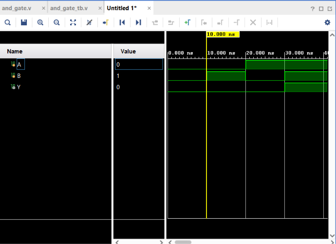

# AND Gate

## Objective

Design and simulate a 2-input AND gate using Verilog HDL and verify its functionality using a Verilog testbench.

## Logic

The AND gate produces a HIGH output only when both inputs are HIGH.

### Boolean Expression

Y = A · B

## Truth Table

| A | B | Y |
|---|---|---|
| 0 | 0 | 0 |
| 0 | 1 | 0 |
| 1 | 0 | 0 |
| 1 | 1 | 1 |

## Verilog Implementation

The AND gate was implemented using the Verilog bitwise AND operator.

```verilog
assign Y = A & B;

## Simulation

**Tool:** Xilinx Vivado 2023.1

**Simulation Type:** Behavioral Simulation

### Simulation Waveform


