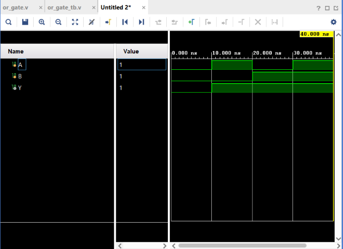

# OR Gate

## Objective

Design and simulate a 2-input OR gate using Verilog HDL and verify its functionality using a Verilog testbench.

## Logic

An OR gate produces a HIGH output when **at least one of its inputs is HIGH**.

### Boolean Expression

$$
Y = A + B
$$

> In Boolean algebra, `+` represents the OR operation.

## Truth Table

| A | B | Y |
| - | - | - |
| 0 | 0 | 0 |
| 0 | 1 | 1 |
| 1 | 0 | 1 |
| 1 | 1 | 1 |

## Verilog Implementation

The OR gate was implemented using the Verilog bitwise OR operator:

```verilog
assign Y = A | B;
```

## Testbench

The testbench applies all four possible combinations of the two input signals:

* A = 0, B = 0
* A = 1, B = 0
* A = 0, B = 1
* A = 1, B = 1

The output `Y` is observed for each combination.

## Simulation

**Tool:** Xilinx Vivado 2023.1

**Simulation Type:** Behavioral Simulation

### Simulation Waveform



## Result

The simulation output matches the expected OR gate truth table.

The output is LOW only when both inputs are LOW:

$$
A=0,\ B=0 \Rightarrow Y=0
$$

For all other input combinations:

$$
Y=1
$$

## Files

| File           | Description                       |
| -------------- | --------------------------------- |
| `or_gate.v`    | Verilog RTL design of the OR gate |
| `or_gate_tb.v` | Verilog testbench                 |
| `waveform.png` | Vivado simulation waveform        |
| `README.md`    | Project documentation             |

## Tools Used

* Verilog HDL
* Xilinx Vivado 2023.1

## Learning Outcome

This project helped me understand the implementation of an OR gate using Verilog HDL, module instantiation, testbench development, and behavioral simulation using Vivado.

