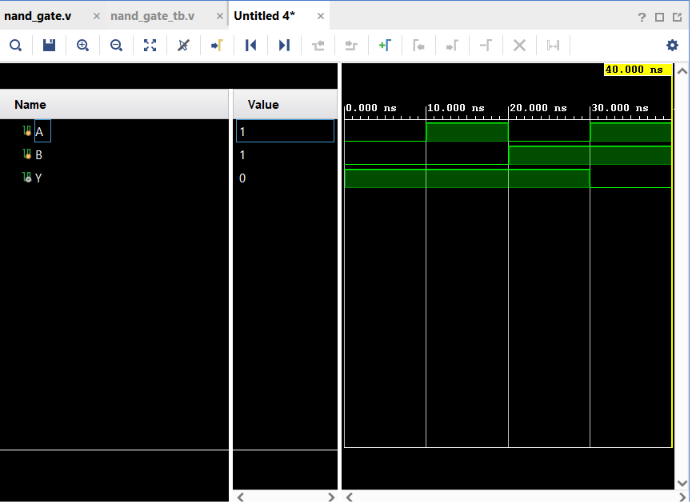

# NAND Gate

## Objective

Design and simulate a 2-input NAND gate using Verilog HDL and verify its functionality using a Verilog testbench.

## Logic

A NAND gate is the complement of an AND gate. It produces a **LOW output only when both inputs are HIGH**.

### Boolean Expression

$$
Y = \overline{A \cdot B}
$$

## Truth Table

| A | B | Y |
| - | - | - |
| 0 | 0 | 1 |
| 0 | 1 | 1 |
| 1 | 0 | 1 |
| 1 | 1 | 0 |

## Verilog Implementation

The NAND gate was implemented by combining the Verilog AND operator `&` with the bitwise NOT operator `~`.

```verilog
assign Y = ~(A & B);
```

The operation can be understood as:

```text
A, B → AND → NOT → Y
```

## Testbench

The testbench applies all four possible combinations of the two input signals:

* A = 0, B = 0
* A = 1, B = 0
* A = 0, B = 1
* A = 1, B = 1

The output `Y` is observed for each combination.

## Simulation

**Tool:** Xilinx Vivado 2023.1

**Simulation Type:** Behavioral Simulation

### Simulation Waveform



## Result

The simulation output matches the expected NAND gate truth table.

The output becomes LOW only when both inputs are HIGH:

$$
A=1,\ B=1 \Rightarrow Y=0
$$

For all other input combinations:

$$
Y=1
$$

## Files

| File             | Description                         |
| ---------------- | ----------------------------------- |
| `nand_gate.v`    | Verilog RTL design of the NAND gate |
| `nand_gate_tb.v` | Verilog testbench                   |
| `waveform.png`   | Vivado simulation waveform          |
| `README.md`      | Project documentation               |

## Tools Used

* Verilog HDL
* Xilinx Vivado 2023.1

## Learning Outcome

This project helped me understand how basic Verilog operators can be combined to implement a NAND gate, along with module instantiation, testbench development, and behavioral simulation using Vivado.

