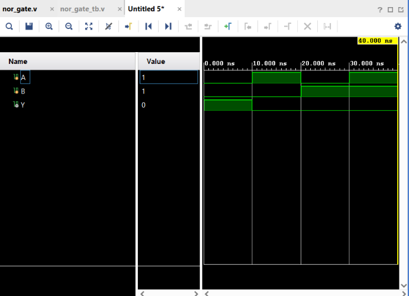

# NOR Gate

## Objective

Design and simulate a 2-input NOR gate using Verilog HDL and verify its functionality using a Verilog testbench.

## Logic

A NOR gate is the complement of an OR gate. It produces a **HIGH output only when both inputs are LOW**.

### Boolean Expression

$$
Y = \overline{A + B}
$$

## Truth Table

| A | B | Y |
| - | - | - |
| 0 | 0 | 1 |
| 0 | 1 | 0 |
| 1 | 0 | 0 |
| 1 | 1 | 0 |

## Verilog Implementation

The NOR gate was implemented by combining the Verilog OR operator `|` with the bitwise NOT operator `~`.

```verilog
assign Y = ~(A | B);
```

The operation can be understood as:

```text
A, B → OR → NOT → Y
```

## Testbench

The testbench applies all four possible combinations of the two input signals:

* A = 0, B = 0
* A = 1, B = 0
* A = 0, B = 1
* A = 1, B = 1

The output `Y` is observed for each combination.

## Simulation

**Tool:** Xilinx Vivado 2023.1

**Simulation Type:** Behavioral Simulation

### Simulation Waveform



## Result

The simulation output matches the expected NOR gate truth table.

The output becomes HIGH only when both inputs are LOW:

$$
A=0,\ B=0 \Rightarrow Y=1
$$

For all other input combinations:

$$
Y=0
$$

## Files

| File            | Description                        |
| --------------- | ---------------------------------- |
| `nor_gate.v`    | Verilog RTL design of the NOR gate |
| `nor_gate_tb.v` | Verilog testbench                  |
| `waveform.png`  | Vivado simulation waveform         |
| `README.md`     | Project documentation              |

## Tools Used

* Verilog HDL
* Xilinx Vivado 2023.1

## Learning Outcome

This project helped me understand how an OR operation can be combined with inversion to implement a NOR gate using Verilog HDL. I also practiced module instantiation, testbench development, and behavioral simulation using Vivado.

