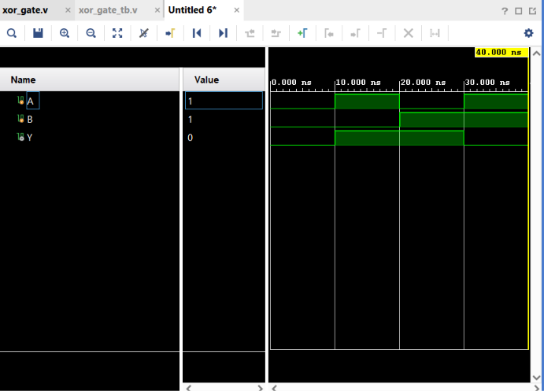

# XOR Gate

## Objective

Design and simulate a 2-input XOR gate using Verilog HDL and verify its functionality using a Verilog testbench.

## Logic

An XOR (Exclusive-OR) gate produces a HIGH output when the two inputs are **different**.

### Boolean Expression

$$
Y = \overline{A}B + A\overline{B}
$$

The XOR operation can also be represented as:

$$
Y = A \oplus B
$$

## Truth Table

| A | B | Y |
| - | - | - |
| 0 | 0 | 0 |
| 0 | 1 | 1 |
| 1 | 0 | 1 |
| 1 | 1 | 0 |

## Verilog Implementation

The XOR gate was implemented using basic Verilog operators rather than directly using the XOR operator.

```verilog
assign Y = (~A & B) | (A & ~B);
```

The implementation can be understood as:

```text
        ┌── NOT ──┐
A ──────┤         AND ──┐
        └─────────┘     │
                        OR ── Y
        ┌─────────┐     │
B ──────┤   AND   ├─────┘
        └─────────┘
```

The two terms are:

$$
\overline{A}B
$$

and

$$
A\overline{B}
$$

These are ORed together to produce the XOR output.

## Testbench

The testbench applies all four possible combinations of the two input signals:

* A = 0, B = 0
* A = 1, B = 0
* A = 0, B = 1
* A = 1, B = 1

The output `Y` is observed for each combination.

## Simulation

**Tool:** Xilinx Vivado 2023.1

**Simulation Type:** Behavioral Simulation

### Simulation Waveform



## Result

The simulation output matches the expected XOR gate truth table.

The output becomes HIGH when the inputs are different:

$$
A=0,\ B=1 \Rightarrow Y=1
$$

$$
A=1,\ B=0 \Rightarrow Y=1
$$

The output remains LOW when both inputs are the same.

## Files

| File            | Description                        |
| --------------- | ---------------------------------- |
| `xor_gate.v`    | Verilog RTL design of the XOR gate |
| `xor_gate_tb.v` | Verilog testbench                  |
| `waveform.png`  | Vivado simulation waveform         |
| `README.md`     | Project documentation              |

## Tools Used

* Verilog HDL
* Xilinx Vivado 2023.1

## Learning Outcome

This project helped me understand the behavior of an XOR gate and how it can be constructed using basic AND, OR, and NOT operations. I also practiced Verilog module instantiation, testbench development, and behavioral simulation using Vivado.

