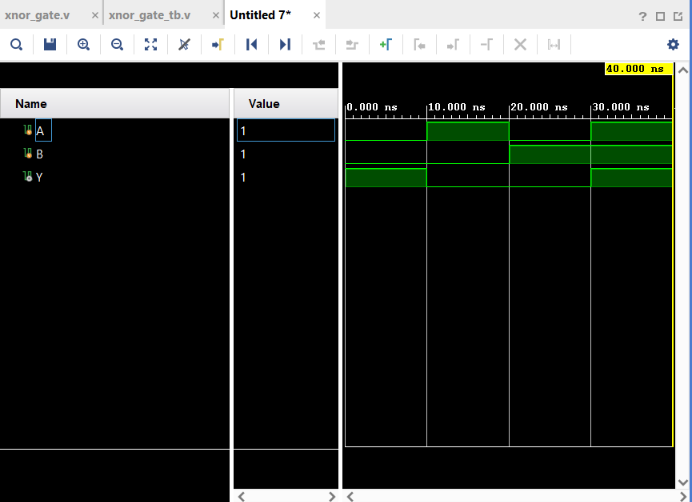

# XNOR Gate

## Objective

Design and simulate a 2-input XNOR gate using Verilog HDL and verify its functionality using a Verilog testbench.

## Logic

An XNOR (Exclusive-NOR) gate produces a HIGH output when the two inputs are **the same**.

### Boolean Expression

$$
Y = AB + \overline{A}\,\overline{B}
$$

XNOR can also be represented as the complement of XOR:

$$
Y = \overline{A \oplus B}
$$

## Truth Table

| A | B | Y |
| - | - | - |
| 0 | 0 | 1 |
| 0 | 1 | 0 |
| 1 | 0 | 0 |
| 1 | 1 | 1 |

## Verilog Implementation

The XNOR gate was implemented using basic Verilog AND, OR, and NOT operators.

```verilog
assign Y = (A & B) | (~A & ~B);
```

The implementation can be understood as:

```text
A ──┬── AND ──┐
B ──┘         │
              OR ── Y
A ── NOT ──┐  │
B ── NOT ──┴── AND
```

The two conditions that produce a HIGH output are:

$$
A=0,\ B=0
$$

and

$$
A=1,\ B=1
$$

Therefore, XNOR produces `1` when both inputs are equal.

## Testbench

The testbench applies all four possible combinations of the two input signals:

* A = 0, B = 0
* A = 1, B = 0
* A = 0, B = 1
* A = 1, B = 1

The output `Y` is observed for each combination.

## Simulation

**Tool:** Xilinx Vivado 2023.1

**Simulation Type:** Behavioral Simulation

### Simulation Waveform



## Result

The simulation output matches the expected XNOR truth table.

The output becomes HIGH when both inputs are the same:

$$
A=0,\ B=0 \Rightarrow Y=1
$$

$$
A=1,\ B=1 \Rightarrow Y=1
$$

When the inputs are different:

$$
A\neq B \Rightarrow Y=0
$$

## Files

| File             | Description                         |
| ---------------- | ----------------------------------- |
| `xnor_gate.v`    | Verilog RTL design of the XNOR gate |
| `xnor_gate_tb.v` | Verilog testbench                   |
| `waveform.png`   | Vivado simulation waveform          |
| `README.md`      | Project documentation               |

## Tools Used

* Verilog HDL
* Xilinx Vivado 2023.1

## Learning Outcome

This project helped me understand the behavior of an XNOR gate and how it can be constructed using basic AND, OR, and NOT operations. I also practiced Verilog module instantiation, testbench development, and behavioral simulation using Vivado.

