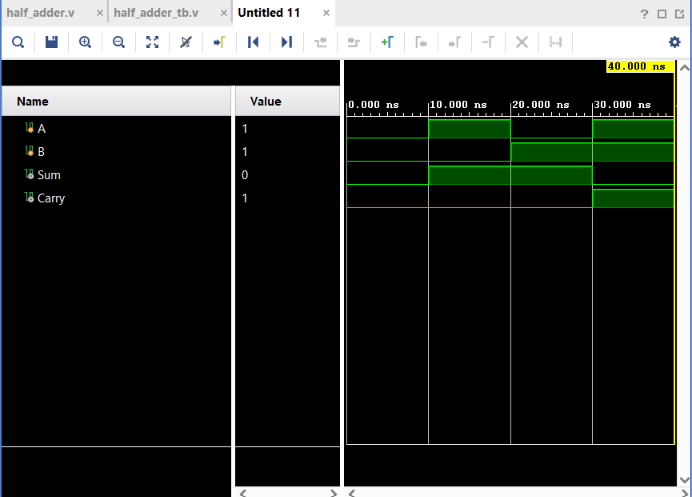

# Half Adder

## Objective

Design and simulate a **1-bit Half Adder** using Verilog HDL and verify its functionality using a Verilog testbench.

## Logic

A Half Adder adds two 1-bit binary numbers and produces two outputs:

* **Sum**
* **Carry**

### Boolean Expressions

$$
Sum = A \oplus B
$$

$$
Carry = A \cdot B
$$

The circuit can be represented as:

```text
A ─────┬──── XOR ──── Sum
       │
B ─────┘

A ─────┬──── AND ──── Carry
       │
B ─────┘
```

## Truth Table

| A | B | Sum | Carry |
| - | - | --- | ----- |
| 0 | 0 | 0   | 0     |
| 0 | 1 | 1   | 0     |
| 1 | 0 | 1   | 0     |
| 1 | 1 | 0   | 1     |

The `1 + 1` case produces:

$$
1+1=10_2
$$

Therefore:

* Sum = `0`
* Carry = `1`

## Verilog Implementation

The Half Adder was implemented using XOR and AND operators.

```verilog
assign Sum = A ^ B;
assign Carry = A & B;
```

## Testbench

The testbench applies all four possible combinations of the two input signals:

* A = 0, B = 0
* A = 1, B = 0
* A = 0, B = 1
* A = 1, B = 1

The `Sum` and `Carry` outputs are observed for each combination.

## Simulation

**Tool:** Xilinx Vivado 2023.1

**Simulation Type:** Behavioral Simulation

**Simulation Time:** 40 ns

### Simulation Waveform



## Result

The simulation output matches the expected Half Adder truth table.

The circuit correctly generates the Sum and Carry outputs for all possible input combinations.

For the important case:

$$
A=1,\ B=1
$$

the simulation produces:

$$
Sum=0,\ Carry=1
$$

Thus, the Half Adder functionality was successfully verified.

## Files

| File              | Description                          |
| ----------------- | ------------------------------------ |
| `half_adder.v`    | Verilog RTL design of the Half Adder |
| `half_adder_tb.v` | Verilog testbench                    |
| `waveform.png`    | Vivado simulation waveform           |
| `README.md`       | Project documentation                |

## Tools Used

* Verilog HDL
* Xilinx Vivado 2023.1

## Learning Outcome

This project helped me understand how a Half Adder performs 1-bit binary addition using XOR and AND logic. I also practiced designing a multi-output Verilog module, writing a testbench, testing all input combinations, and verifying the design through behavioral simulation in Vivado.

