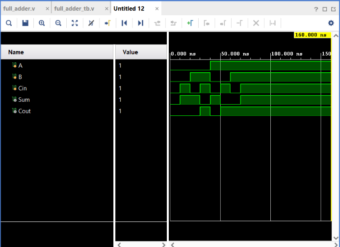

# Full Adder

## Objective

Design and simulate a **1-bit Full Adder** using Verilog HDL and verify its functionality using a Verilog testbench.

## Logic

A Full Adder adds three 1-bit binary values:

* `A`
* `B`
* `Cin` — Carry In

It produces two outputs:

* `Sum`
* `Cout` — Carry Out

### Boolean Expressions

$$
Sum = A \oplus B \oplus C_{in}
$$

$$
C_{out} = AB + BC_{in} + AC_{in}
$$

## Truth Table

| A | B | Cin | Sum | Cout |
| - | - | --- | --- | ---- |
| 0 | 0 | 0   | 0   | 0    |
| 0 | 0 | 1   | 1   | 0    |
| 0 | 1 | 0   | 1   | 0    |
| 0 | 1 | 1   | 0   | 1    |
| 1 | 0 | 0   | 1   | 0    |
| 1 | 0 | 1   | 0   | 1    |
| 1 | 1 | 0   | 0   | 1    |
| 1 | 1 | 1   | 1   | 1    |

For the case:

$$
1+1+1=11_2
$$

the outputs are:

```text
Sum  = 1
Cout = 1
```

## Verilog Implementation

The Full Adder was implemented using XOR, AND, and OR operators.

```verilog
assign Sum = A ^ B ^ Cin;
assign Cout = (A & B) | (B & Cin) | (A & Cin);
```

The Sum is generated using XOR operations, while the Carry Out is generated when at least two of the three inputs are HIGH.

## Testbench

The testbench applies all **8 possible combinations** of the three input signals.

The input sequence tested was:

```text
000
001
010
011
100
101
110
111
```

The `Sum` and `Cout` outputs are observed for each combination.

## Simulation

**Tool:** Xilinx Vivado 2023.1

**Simulation Type:** Behavioral Simulation

**Simulation Time:** 80 ns

### Simulation Waveform



## Result

The simulation output matches the expected Full Adder truth table.

The circuit correctly generates both `Sum` and `Cout` for all possible combinations of `A`, `B`, and `Cin`.

The final test case:

$$
A=1,\ B=1,\ C_{in}=1
$$

produces:

$$
Sum=1,\quad Cout=1
$$

Thus, the Full Adder functionality was successfully verified through behavioral simulation.

## Files

| File              | Description                          |
| ----------------- | ------------------------------------ |
| `full_adder.v`    | Verilog RTL design of the Full Adder |
| `full_adder_tb.v` | Verilog testbench                    |
| `waveform.png`    | Vivado simulation waveform           |
| `README.md`       | Project documentation                |

## Tools Used

* Verilog HDL
* Xilinx Vivado 2023.1

## Learning Outcome

This project helped me understand how a Full Adder performs 1-bit binary addition while considering an incoming carry. I practiced multi-input combinational logic, multiple outputs, exhaustive testbench development, module instantiation, and behavioral simulation using Vivado.

