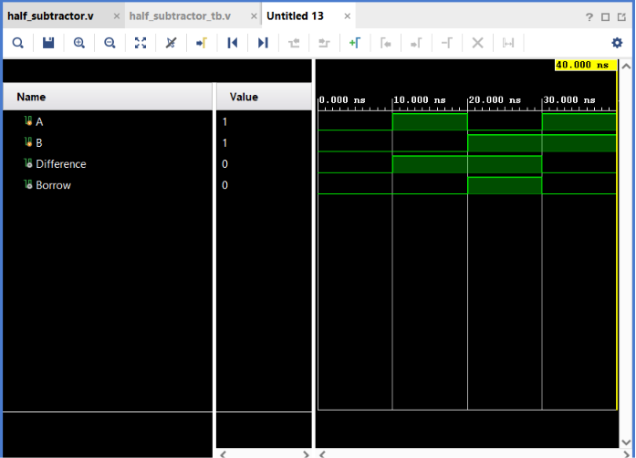

# Half Subtractor

## Objective

Design and simulate a **1-bit Half Subtractor** using Verilog HDL and verify its functionality using a Verilog testbench.

## Logic

A Half Subtractor performs subtraction between two 1-bit binary numbers:

* `A` — Minuend
* `B` — Subtrahend

It produces two outputs:

* `Difference`
* `Borrow`

### Boolean Expressions

$$
Difference = A \oplus B
$$

$$
Borrow = \overline{A}B
$$

## Truth Table

| A | B | Difference | Borrow |
| - | - | ---------- | ------ |
| 0 | 0 | 0          | 0      |
| 0 | 1 | 1          | 1      |
| 1 | 0 | 1          | 0      |
| 1 | 1 | 0          | 0      |

The important case is:

$$
0-1
$$

Since `0` cannot directly subtract `1`, a borrow is required:

```text
Difference = 1
Borrow = 1
```

## Verilog Implementation

The Half Subtractor was implemented using XOR, NOT, and AND operators.

```verilog
assign Difference = A ^ B;
assign Borrow = ~A & B;
```

## Testbench

The testbench applies all **4 possible combinations** of the two input signals:

```text
00
10
01
11
```

A delay of `10 ns` is provided between each test case to observe the output transitions.

## Simulation

**Tool:** Xilinx Vivado 2023.1

**Simulation Type:** Behavioral Simulation

**Simulation Time:** 40 ns

### Simulation Waveform



## Result

The simulation output matches the expected Half Subtractor truth table for all possible input combinations.

The critical subtraction case:

$$
A=0,\ B=1
$$

produces:

$$
Difference=1,\quad Borrow=1
$$

Thus, the Half Subtractor functionality was successfully verified through behavioral simulation.

## Files

| File                   | Description                               |
| ---------------------- | ----------------------------------------- |
| `half_subtractor.v`    | Verilog RTL design of the Half Subtractor |
| `half_subtractor_tb.v` | Verilog testbench                         |
| `waveform.png`         | Vivado simulation waveform                |
| `README.md`            | Project documentation                     |

## Tools Used

* Verilog HDL
* Xilinx Vivado 2023.1

## Learning Outcome

This project helped me understand 1-bit binary subtraction, the concept of borrowing, and the implementation of a Half Subtractor using basic logic gates. I also practiced writing an exhaustive testbench and verifying the design through behavioral simulation in Vivado.

