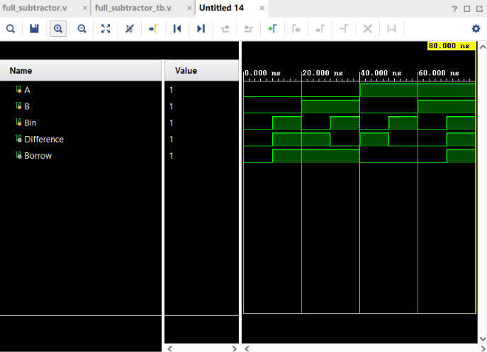

# Full Subtractor

## Objective

Design and simulate a **1-bit Full Subtractor** using Verilog HDL and verify its functionality using a Verilog testbench.

## Logic

A Full Subtractor performs subtraction of three 1-bit binary values:

$$
A-B-B_{in}
$$

where `Bin` represents the **Borrow In** from the previous lower-order bit.

It produces two outputs:

* `Difference`
* `Borrow` — Borrow Out

### Boolean Expressions

$$
Difference=A\oplus B\oplus Bin
$$

$$
Borrow=\overline{A}B+\overline{A}Bin+BBin
$$

## Truth Table

| A | B | Bin | Difference | Borrow |
| - | - | --- | ---------- | ------ |
| 0 | 0 | 0   | 0          | 0      |
| 0 | 0 | 1   | 1          | 1      |
| 0 | 1 | 0   | 1          | 1      |
| 0 | 1 | 1   | 0          | 1      |
| 1 | 0 | 0   | 1          | 0      |
| 1 | 0 | 1   | 0          | 0      |
| 1 | 1 | 0   | 0          | 0      |
| 1 | 1 | 1   | 1          | 1      |

## Verilog Implementation

The Full Subtractor was implemented using XOR, NOT, AND, and OR operators.

```verilog
assign Difference = A ^ B ^ Bin;
assign Borrow = (~A & B) | (~A & Bin) | (B & Bin);
```

## Testbench

The testbench applies all **8 possible combinations** of the three input signals:

```text
000
001
010
011
100
101
110
111
```

A delay of `10 ns` is provided between each test case to observe the output transitions.

## Simulation

**Tool:** Xilinx Vivado 2023.1

**Simulation Type:** Behavioral Simulation

**Simulation Time:** 80 ns

### Simulation Waveform



## Result

The simulation output matches the expected Full Subtractor truth table for all possible input combinations.

The circuit correctly generates the `Difference` and `Borrow` outputs for every combination of `A`, `B`, and `Bin`.

For example:

$$
A=0,\ B=1,\ Bin=1
$$

produces:

$$
Difference=0,\quad Borrow=1
$$

Similarly:

$$
A=1,\ B=1,\ Bin=1
$$

produces:

$$
Difference=1,\quad Borrow=1
$$

Thus, the Full Subtractor functionality was successfully verified through behavioral simulation.

## Files

| File                   | Description                               |
| ---------------------- | ----------------------------------------- |
| `full_subtractor.v`    | Verilog RTL design of the Full Subtractor |
| `full_subtractor_tb.v` | Verilog testbench                         |
| `waveform.png`         | Vivado simulation waveform                |
| `README.md`            | Project documentation                     |

## Tools Used

* Verilog HDL
* Xilinx Vivado 2023.1

## Learning Outcome

This project helped me understand **multi-input binary subtraction and borrow propagation**. I practiced implementing combinational logic using Boolean expressions, writing an exhaustive testbench for all input combinations, and verifying the RTL design through behavioral simulation in Vivado.

