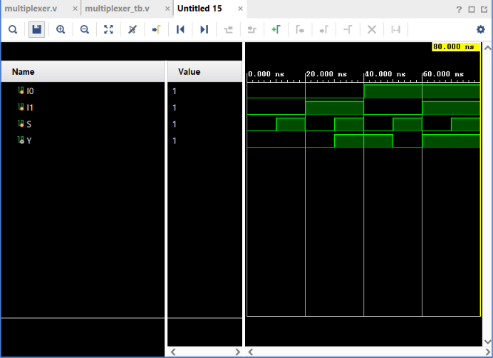

# 2:1 Multiplexer

## Objective

Design and simulate a **2:1 Multiplexer (MUX)** using Verilog HDL and verify its functionality using a Verilog testbench.

## Logic

A 2:1 Multiplexer selects one of two data inputs and passes the selected input to the output based on the select signal.

### Inputs

* `I0` — Data Input 0
* `I1` — Data Input 1
* `S` — Select Signal

### Output

* `Y` — Selected Output

### Operation

| Select `S` | Output `Y` |
| ---------- | ---------- |
| 0          | `I0`       |
| 1          | `I1`       |

### Boolean Expression

$$
Y=\overline{S}I_0+SI_1
$$

When `S = 0`, the output follows `I0`.

When `S = 1`, the output follows `I1`.

## Truth Table

| I0 | I1 | S | Y |
| -- | -- | - | - |
| 0  | 0  | 0 | 0 |
| 0  | 0  | 1 | 0 |
| 0  | 1  | 0 | 0 |
| 0  | 1  | 1 | 1 |
| 1  | 0  | 0 | 1 |
| 1  | 0  | 1 | 0 |
| 1  | 1  | 0 | 1 |
| 1  | 1  | 1 | 1 |

## Verilog Implementation

The Multiplexer was implemented using NOT, AND, and OR operators.

```verilog
assign Y = (~S & I0) | (S & I1);
```

The two AND terms represent the two possible input paths, while the select signal determines which path is active.

## Testbench

The testbench applies all **8 possible combinations** of `I0`, `I1`, and `S`.

The input combinations tested were:

```text
000
001
010
011
100
101
110
111
```

A delay of `10 ns` is provided between each test case to observe the output transitions.

## Simulation

**Tool:** Xilinx Vivado 2023.1

**Simulation Type:** Behavioral Simulation

**Simulation Time:** 80 ns

### Simulation Waveform



## Result

The simulation output matches the expected Multiplexer truth table for all possible input combinations.

The select signal correctly determines which input is passed to the output:

$$
S=0 \Rightarrow Y=I_0
$$

$$
S=1 \Rightarrow Y=I_1
$$

Thus, the **2:1 Multiplexer functionality was successfully verified through behavioral simulation in Vivado**.

## Files

| File               | Description                               |
| ------------------ | ----------------------------------------- |
| `multiplexer.v`    | Verilog RTL design of the 2:1 Multiplexer |
| `multiplexer_tb.v` | Verilog testbench                         |
| `waveform.png`     | Vivado simulation waveform                |
| `README.md`        | Project documentation                     |

## Tools Used

* Verilog HDL
* Xilinx Vivado 2023.1

## Learning Outcome

This project helped me understand the operation of a **2:1 Multiplexer** and how a select signal controls data routing. I practiced implementing Boolean logic in Verilog, creating an exhaustive testbench, and verifying the RTL design through behavioral simulation.

