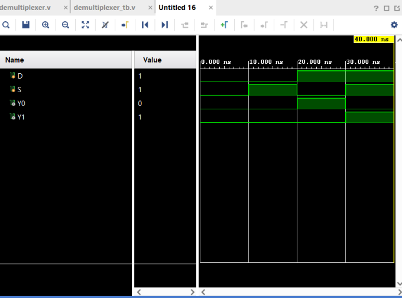

# 1:2 Demultiplexer

## Objective

Design and simulate a **1:2 Demultiplexer (DEMUX)** using Verilog HDL and verify its functionality using a Verilog testbench.

## Logic

A Demultiplexer takes a **single data input** and routes it to one of multiple outputs based on a select signal.

This project implements a **1:2 Demultiplexer**.

### Inputs

* `D` — Data Input
* `S` — Select Signal

### Outputs

* `Y0` — Output 0
* `Y1` — Output 1

### Operation

| Select `S` | Output             |
| ---------- | ------------------ |
| 0          | `Y0 = D`, `Y1 = 0` |
| 1          | `Y0 = 0`, `Y1 = D` |

### Boolean Expressions

$$
Y_0 = D\overline{S}
$$

$$
Y_1 = DS
$$

## Truth Table

| D | S | Y0 | Y1 |
| - | - | -- | -- |
| 0 | 0 | 0  | 0  |
| 0 | 1 | 0  | 0  |
| 1 | 0 | 1  | 0  |
| 1 | 1 | 0  | 1  |

## Verilog Implementation

The Demultiplexer was implemented using AND and NOT operators.

```verilog
assign Y0 = D & ~S;
assign Y1 = D & S;
```

The select signal determines which output receives the input data.

## Testbench

The testbench applies all **4 possible combinations** of `D` and `S`:

```text
00
01
10
11
```

A delay of `10 ns` is provided between each test case to observe the output transitions.

## Simulation

**Tool:** Xilinx Vivado 2023.1

**Simulation Type:** Behavioral Simulation

**Simulation Time:** 40 ns

### Simulation Waveform



## Result

The simulation output matches the expected Demultiplexer truth table for all input combinations.

The circuit correctly routes the input data according to the select signal:

$$
S=0 \Rightarrow Y_0=D,\ Y_1=0
$$

$$
S=1 \Rightarrow Y_0=0,\ Y_1=D
$$

Thus, the **1:2 Demultiplexer functionality was successfully verified through behavioral simulation in Vivado**.

## Files

| File                 | Description                                 |
| -------------------- | ------------------------------------------- |
| `demultiplexer.v`    | Verilog RTL design of the 1:2 Demultiplexer |
| `demultiplexer_tb.v` | Verilog testbench                           |
| `waveform.png`       | Vivado simulation waveform                  |
| `README.md`          | Project documentation                       |

## Tools Used

* Verilog HDL
* Xilinx Vivado 2023.1

## Learning Outcome

This project helped me understand **data routing using a Demultiplexer** and how a select signal determines which output receives the input. I practiced implementing combinational logic in Verilog, creating a complete testbench, and verifying the RTL design through behavioral simulation.

