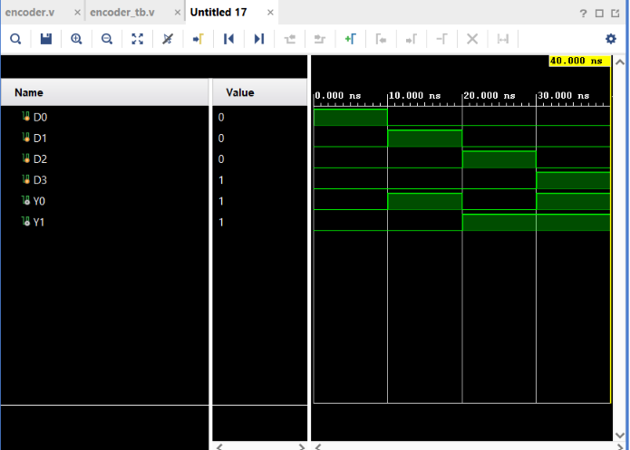

# 4:2 Encoder

## Objective

Design and simulate a **4:2 Encoder** using Verilog HDL and verify its functionality using a Verilog testbench.

## Logic

A 4:2 Encoder converts one active input among four inputs into a corresponding 2-bit binary code.

### Inputs

* `D0` — Input 0
* `D1` — Input 1
* `D2` — Input 2
* `D3` — Input 3

### Outputs

* `Y1`
* `Y0`

The encoder assumes that **only one input is HIGH at a time**.

### Encoding

| Active Input | Y1 | Y0 |
| ------------ | -: | -: |
| D0           |  0 |  0 |
| D1           |  0 |  1 |
| D2           |  1 |  0 |
| D3           |  1 |  1 |

## Boolean Expressions

$$
Y_0=D_1+D_3
$$

$$
Y_1=D_2+D_3
$$

## Truth Table

| D3 | D2 | D1 | D0 | Y1 | Y0 |
| -: | -: | -: | -: | -: | -: |
|  0 |  0 |  0 |  1 |  0 |  0 |
|  0 |  0 |  1 |  0 |  0 |  1 |
|  0 |  1 |  0 |  0 |  1 |  0 |
|  1 |  0 |  0 |  0 |  1 |  1 |

## Verilog Implementation

The Encoder was implemented using OR gates.

```verilog
assign Y0 = D1 | D3;
assign Y1 = D2 | D3;
```

## Testbench

The testbench verifies all **4 valid one-hot input combinations**:

```text
D0 D1 D2 D3

1  0  0  0
0  1  0  0
0  0  1  0
0  0  0  1
```

A delay of `10 ns` is provided between each test case.

## Simulation

**Tool:** Xilinx Vivado 2023.1

**Simulation Type:** Behavioral Simulation

**Simulation Time:** 40 ns

### Simulation Waveform



## Result

The simulation output matches the expected encoder operation for all valid one-hot input combinations.

The circuit correctly converts the active input into its corresponding 2-bit binary code:

```text
D0 → 00
D1 → 01
D2 → 10
D3 → 11
```

Thus, the **4:2 Encoder functionality was successfully verified through behavioral simulation in Vivado**.

## Files

| File           | Description                           |
| -------------- | ------------------------------------- |
| `encoder.v`    | Verilog RTL design of the 4:2 Encoder |
| `encoder_tb.v` | Verilog testbench                     |
| `waveform.png` | Vivado simulation waveform            |
| `README.md`    | Project documentation                 |

## Tools Used

* Verilog HDL
* Xilinx Vivado 2023.1

## Learning Outcome

This project helped me understand **binary encoding and one-hot input representation**. I practiced implementing combinational logic using Boolean expressions, creating a testbench for valid input combinations, and verifying the RTL design through behavioral simulation in Vivado.

