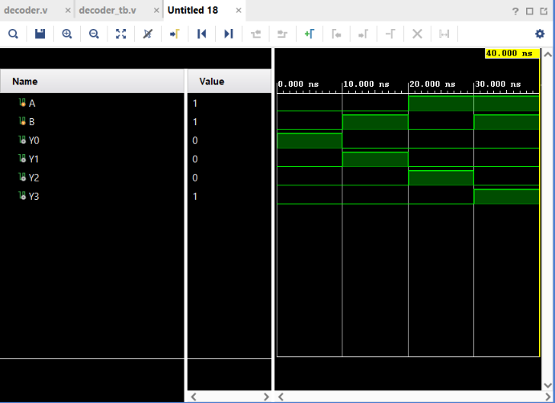

# 2:4 Decoder

## Objective

Design and simulate a **2:4 Decoder** using Verilog HDL and verify its functionality using a Verilog testbench.

## Logic

A 2:4 Decoder converts a **2-bit binary input** into one of four active outputs.

### Inputs

* `A` — Input bit A
* `B` — Input bit B

### Outputs

* `Y0`
* `Y1`
* `Y2`
* `Y3`

For each input combination, exactly **one output is HIGH**.

### Boolean Expressions

$$
Y_0=\overline{A}\,\overline{B}
$$

$$
Y_1=\overline{A}B
$$

$$
Y_2=A\overline{B}
$$

$$
Y_3=AB
$$

## Truth Table

| A | B | Y0 | Y1 | Y2 | Y3 |
| - | - | -- | -- | -- | -- |
| 0 | 0 | 1  | 0  | 0  | 0  |
| 0 | 1 | 0  | 1  | 0  | 0  |
| 1 | 0 | 0  | 0  | 1  | 0  |
| 1 | 1 | 0  | 0  | 0  | 1  |

The output pattern is:

```text
00 → 1000
01 → 0100
10 → 0010
11 → 0001
```

## Verilog Implementation

The decoder was implemented using NOT and AND operators.

```verilog
assign Y0 = ~A & ~B;
assign Y1 = ~A & B;
assign Y2 = A & ~B;
assign Y3 = A & B;
```

## Testbench

The testbench verifies all **4 possible combinations** of the two input signals:

```text
00
01
10
11
```

A delay of `10 ns` is provided between each test case to observe the output transitions.

## Simulation

**Tool:** Xilinx Vivado 2023.1

**Simulation Type:** Behavioral Simulation

**Simulation Time:** 40 ns

### Simulation Waveform



## Result

The simulation output matches the expected Decoder truth table for all possible input combinations.

The circuit correctly activates exactly one output for each binary input:

```text
AB = 00 → Y0 = 1
AB = 01 → Y1 = 1
AB = 10 → Y2 = 1
AB = 11 → Y3 = 1
```

Thus, the **2:4 Decoder functionality was successfully verified through behavioral simulation in Vivado**.

## Files

| File           | Description                           |
| -------------- | ------------------------------------- |
| `decoder.v`    | Verilog RTL design of the 2:4 Decoder |
| `decoder_tb.v` | Verilog testbench                     |
| `waveform.png` | Vivado simulation waveform            |
| `README.md`    | Project documentation                 |

## Tools Used

* Verilog HDL
* Xilinx Vivado 2023.1

## Learning Outcome

This project helped me understand **binary decoding and one-hot output generation**. I practiced implementing combinational logic using Boolean expressions, creating a complete testbench, and verifying the RTL design through behavioral simulation in Vivado.

