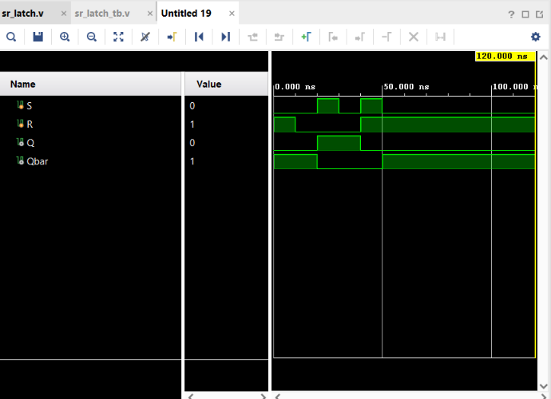

# SR Latch

## Objective

Design and simulate an **SR (Set-Reset) Latch** using Verilog HDL and verify its functionality using a Verilog testbench.

Unlike combinational circuits, an SR Latch is a **sequential logic circuit** capable of storing one bit of information.

## Logic

This project implements a **NOR-gate based SR Latch** with active-HIGH inputs.

### Inputs

* `S` — Set
* `R` — Reset

### Outputs

* `Q` — Stored output
* `Qbar` — Complement of `Q`

### Operation

| S | R | Q(next)     | Qbar           | Operation |
| - | - | ----------- | -------------- | --------- |
| 0 | 0 | Q(previous) | Qbar(previous) | Hold      |
| 0 | 1 | 0           | 1              | Reset     |
| 1 | 0 | 1           | 0              | Set       |
| 1 | 1 | 0           | 0              | Forbidden |

The `00` condition allows the latch to **retain its previous state**, providing the memory behavior of the circuit.

The `11` condition is considered **forbidden/invalid** because both outputs become `0`, violating the normal complementary relationship between `Q` and `Qbar`.

## Boolean Expressions

The cross-coupled NOR gates are represented as:

$$
Q=\overline{R+Qbar}
$$

$$
Qbar=\overline{S+Q}
$$

## Verilog Implementation

The latch was implemented using cross-coupled NOR logic:

```verilog
assign Q = ~(R | Qbar);
assign Qbar = ~(S | Q);
```

The feedback between `Q` and `Qbar` allows the circuit to retain its previous state when both inputs are LOW.

## Testbench

The testbench verifies the major operating conditions:

1. Reset
2. Hold
3. Set
4. Hold
5. Forbidden condition
6. Reset

The test sequence demonstrates that the latch can retain both logic `0` and logic `1`.

## Simulation

**Tool:** Xilinx Vivado 2023.1

**Simulation Type:** Behavioral Simulation

**Test Sequence:** 6 operating conditions

### Simulation Waveform



## Result

The simulation successfully demonstrates the behavior of the NOR-based SR Latch.

The circuit correctly performs:

```text
S = 0, R = 1 → Reset
S = 1, R = 0 → Set
S = 0, R = 0 → Hold previous state
S = 1, R = 1 → Forbidden state
```

The simulation particularly demonstrates the **memory characteristic** of the latch: when `S = 0` and `R = 0`, the output retains its previously stored value.

Thus, the **SR Latch functionality was successfully verified through behavioral simulation in Vivado**.

## Files

| File            | Description                        |
| --------------- | ---------------------------------- |
| `sr_latch.v`    | Verilog RTL design of the SR Latch |
| `sr_latch_tb.v` | Verilog testbench                  |
| `waveform.png`  | Vivado simulation waveform         |
| `README.md`     | Project documentation              |

## Tools Used

* Verilog HDL
* Xilinx Vivado 2023.1

## Learning Outcome

This project introduced **sequential logic and memory elements**. I learned how cross-coupled feedback allows an SR Latch to store a single bit of information, understood the Set, Reset, Hold, and Forbidden conditions, and verified the circuit through behavioral simulation in Vivado.

