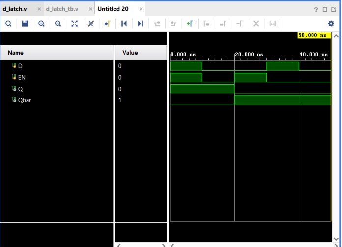

# D Latch

## Objective

Design and simulate a **D (Data) Latch** using Verilog HDL and verify its functionality using a Verilog testbench.

A D Latch is a **level-sensitive sequential logic circuit** capable of storing one bit of information.

## Logic

The D Latch has two inputs and two outputs.

### Inputs

* `D` — Data Input
* `EN` — Enable

### Outputs

* `Q` — Stored Output
* `Qbar` — Complement of Q

### Operation

| EN | D | Q(next)     | Operation |
| -- | - | ----------- | --------- |
| 0  | 0 | Q(previous) | Hold      |
| 0  | 1 | Q(previous) | Hold      |
| 1  | 0 | 0           | Load 0    |
| 1  | 1 | 1           | Load 1    |

When `EN = 1`, the latch is **transparent**, meaning `Q` follows `D`.

When `EN = 0`, the latch **holds its previous state**, providing memory.

## Boolean Behavior

When enabled:

$$
Q=D
$$

$$
Qbar=\overline{D}
$$

When disabled:

$$
Q=Q(previous)
$$

$$
Qbar=Qbar(previous)
$$

## Verilog Implementation

The D Latch was implemented using an `always` block:

```verilog
always @ (D or EN)
begin
    if(EN)
    begin
        Q = D;
        Qbar = ~D;
    end
end
```

The absence of an `else` condition allows `Q` and `Qbar` to retain their previous values when `EN = 0`, modeling latch behavior.

## Testbench

The testbench verifies both the **load** and **hold** operations.

The sequence used was:

```text
D = 1, EN = 1 → Load 1
D = 0, EN = 0 → Hold 1
D = 0, EN = 1 → Load 0
D = 1, EN = 0 → Hold 0
D = 0, EN = 0 → Hold 0
```

A delay of `10 ns` is provided between each test case.

## Simulation

**Tool:** Xilinx Vivado 2023.1

**Simulation Type:** Behavioral Simulation

**Simulation Time:** 50 ns

### Simulation Waveform



## Result

The simulation successfully demonstrates the behavior of the D Latch.

When:

```text
EN = 1 → Q follows D
EN = 0 → Q retains its previous value
```

The simulation verifies that the D Latch can store both logic `0` and logic `1`.

Thus, the **D Latch functionality was successfully verified through behavioral simulation in Vivado**.

## Files

| File           | Description                       |
| -------------- | --------------------------------- |
| `d_latch.v`    | Verilog RTL design of the D Latch |
| `d_latch_tb.v` | Verilog testbench                 |
| `waveform.png` | Vivado simulation waveform        |
| `README.md`    | Project documentation             |

## Tools Used

* Verilog HDL
* Xilinx Vivado 2023.1

## Learning Outcome

This project introduced **level-sensitive sequential logic** and the concept of a latch. I learned how an `always` block can be used to describe behavioral hardware, how an enable signal controls data storage, and how feedback allows the circuit to retain its previous state. I also learned the difference between a **latch and combinational logic**.

