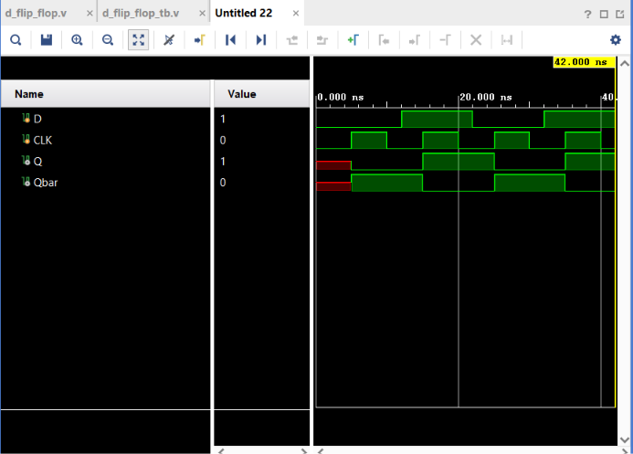

# D Flip-Flop

## Objective

Design and simulate a **positive-edge triggered D Flip-Flop** using Verilog HDL and verify its functionality using a Verilog testbench.

A D Flip-Flop is an **edge-triggered sequential logic circuit** that stores one bit of data.

## Logic

### Inputs

* `D` — Data Input
* `CLK` — Clock

### Outputs

* `Q` — Stored Output
* `Qbar` — Complement of Q

The flip-flop captures the value of `D` only on the **rising edge** of the clock.

### Operation

| Clock Event     |      D |     Q(next) |
| --------------- | -----: | ----------: |
| No rising edge  | 0 or 1 | Q(previous) |
| Rising edge `↑` |      0 |           0 |
| Rising edge `↑` |      1 |           1 |

The key behavior is:

$$
CLK \uparrow \Rightarrow Q=D
$$

$$
Qbar=\overline{Q}
$$

## Positive Edge Triggering

A positive or rising edge occurs when the clock transitions:

```text
0 → 1
```

The Verilog statement:

```verilog
always @ (posedge CLK)
```

causes the flip-flop to update only when this rising edge occurs.

Changes in `D` between clock edges do not immediately affect `Q`.

## Verilog Implementation

The D Flip-Flop was implemented using a clock-sensitive `always` block.

```verilog
always @ (posedge CLK)
begin
    Q = D;
    Qbar = ~D;
end
```

## Testbench

The testbench generates a continuous clock using:

```verilog
always #5 CLK = ~CLK;
```

This produces a **10 ns clock period**.

The testbench changes `D` at different times to verify that `Q` responds only to the rising edge of `CLK`.

### Test Sequence

```text
D = 0
D = 1
D = 0
D = 1
```

The testbench intentionally changes `D` between clock edges to demonstrate the edge-triggered behavior.

## Simulation

**Tool:** Xilinx Vivado 2023.1

**Simulation Type:** Behavioral Simulation

**Simulation Time:** 42 ns

### Simulation Waveform



## Result

The simulation successfully demonstrates the behavior of a positive-edge triggered D Flip-Flop.

The output changes only on the rising edge of the clock:

```text
CLK rising edge → Q captures D
No rising edge  → Q holds previous value
```

For example, when `D` changes between clock edges, `Q` remains unchanged until the next rising edge.

The complement output also behaves correctly:

$$
Qbar=\overline{Q}
$$

Thus, the **D Flip-Flop functionality was successfully verified through behavioral simulation in Vivado**.

## D Latch vs D Flip-Flop

| D Latch                    | D Flip-Flop                  |
| -------------------------- | ---------------------------- |
| Level-sensitive            | Edge-sensitive               |
| Controlled by Enable       | Controlled by Clock          |
| Q can change while enabled | Q changes only at clock edge |
| `always @ (D or EN)`       | `always @ (posedge CLK)`     |

## Files

| File               | Description                           |
| ------------------ | ------------------------------------- |
| `d_flip_flop.v`    | Verilog RTL design of the D Flip-Flop |
| `d_flip_flop_tb.v` | Verilog testbench                     |
| `waveform.png`     | Vivado simulation waveform            |
| `README.md`        | Project documentation                 |

## Tools Used

* Verilog HDL
* Xilinx Vivado 2023.1

## Learning Outcome

This project introduced **edge-triggered sequential logic** and clock-based data storage. I learned how `posedge` is used to detect a rising clock edge, how a D Flip-Flop captures data only at that edge, and how it differs from a level-sensitive D Latch. I also practiced generating a clock signal in a Verilog testbench and verifying sequential behavior through behavioral simulation.

