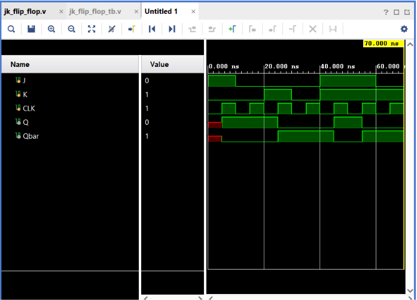

# JK Flip-Flop

## Objective

Design and simulate a **positive-edge triggered JK Flip-Flop** using Verilog HDL and verify its functionality using a Verilog testbench.

A JK Flip-Flop is a clocked sequential logic circuit that can **hold, set, reset, or toggle** its output.

## Inputs

* `J` — Set/Toggle input
* `K` — Reset/Toggle input
* `CLK` — Clock

## Outputs

* `Q` — Stored output
* `Qbar` — Complement of Q

## JK Flip-Flop Truth Table

| J | K | Q(next)      | Operation |
| - | - | ------------ | --------- |
| 0 | 0 | Q(previous)  | Hold      |
| 0 | 1 | 0            | Reset     |
| 1 | 0 | 1            | Set       |
| 1 | 1 | ~Q(previous) | Toggle    |

The flip-flop responds only to the **rising edge** of the clock.

## Positive Edge Triggering

A rising edge occurs when:

```text
CLK: 0 → 1
```

The Verilog statement:

```verilog
always @(posedge CLK)
```

ensures that the JK Flip-Flop updates only on the rising edge of the clock.

## Verilog Implementation

The JK Flip-Flop was implemented using a `case` statement based on the combined `J` and `K` inputs.

```verilog
always @(posedge CLK)
begin

    case ({J, K})

        2'b00:
            Q = Q;

        2'b01:
            Q = 0;

        2'b10:
            Q = 1;

        2'b11:
            Q = ~Q;

    endcase

    Qbar = ~Q;

end
```

### Operation Mapping

```text
00 → Hold
01 → Reset
10 → Set
11 → Toggle
```

## Testbench

The testbench generates a continuous clock using:

```verilog
always #5 CLK = ~CLK;
```

This creates a **10 ns clock period**.

The testbench verifies:

1. Set
2. Hold
3. Reset
4. Hold
5. Toggle
6. Toggle again
7. Reset

Testing the toggle condition for two consecutive clock cycles demonstrates that the output changes state on every rising edge when:

```text
J = 1
K = 1
```

## Expected Toggle Behavior

When `J = 1` and `K = 1`:

```text
Q = 0
   ↓ CLK ↑
Q = 1
   ↓ CLK ↑
Q = 0
```

## Simulation

**Tool:** Xilinx Vivado 2023.1

**Simulation Type:** Behavioral Simulation

**Simulation Time:** 70 ns

### Simulation Waveform



## Result

The simulation successfully verifies all four operating modes of the JK Flip-Flop:

```text
J = 0, K = 0 → Hold
J = 0, K = 1 → Reset
J = 1, K = 0 → Set
J = 1, K = 1 → Toggle
```

The waveform also confirms that the output changes only on the **rising edge of the clock**.

The toggle operation was successfully verified over two consecutive clock cycles:

```text
Q: 0 → 1 → 0
```

The complement output maintains:

$$
Qbar=\overline{Q}
$$

for the valid operating states.

Thus, the **JK Flip-Flop functionality was successfully verified through behavioral simulation in Vivado**.

## D Flip-Flop vs JK Flip-Flop

| D Flip-Flop             | JK Flip-Flop                             |
| ----------------------- | ---------------------------------------- |
| One data input          | Two control inputs                       |
| Captures D              | Set, reset, hold, or toggle              |
| `Q = D` at clock edge   | Behavior depends on J and K              |
| Useful for data storage | Useful for counters and control circuits |

## Files

| File                | Description                            |
| ------------------- | -------------------------------------- |
| `jk_flip_flop.v`    | Verilog RTL design of the JK Flip-Flop |
| `jk_flip_flop_tb.v` | Verilog testbench                      |
| `waveform.png`      | Vivado simulation waveform             |
| `README.md`         | Project documentation                  |

## Tools Used

* Verilog HDL
* Xilinx Vivado 2023.1

## Learning Outcome

This project helped me understand the **JK Flip-Flop and its four operating modes: Hold, Reset, Set, and Toggle**. I learned how `case` statements can describe different hardware behaviors based on multiple inputs, how concatenation `{J, K}` represents a combined 2-bit condition, and how a clocked `always @(posedge CLK)` block implements edge-triggered sequential logic.

