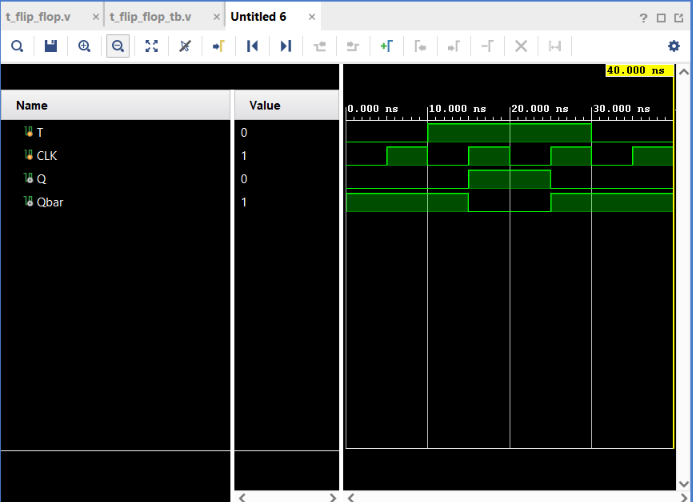

# T Flip-Flop

## Objective

Design and simulate a **positive-edge triggered T (Toggle) Flip-Flop** using Verilog HDL and verify its functionality using a Verilog testbench.

A T Flip-Flop is a sequential logic circuit that can **hold** its current state or **toggle** its output depending on the T input.

## Inputs

* `T` — Toggle input
* `CLK` — Clock

## Outputs

* `Q` — Stored output
* `Qbar` — Complement of Q

## Truth Table

| T | Q(next)      | Operation |
| - | ------------ | --------- |
| 0 | Q(previous)  | Hold      |
| 1 | ~Q(previous) | Toggle    |

The output changes only on the **rising edge** of the clock.

## Operation

When:

```text
T = 0 → Q holds its previous state
T = 1 → Q toggles its previous state
```

For example, when `T = 1`:

```text
Q = 0
   ↓ CLK ↑
Q = 1
   ↓ CLK ↑
Q = 0
```

## Verilog Implementation

The T Flip-Flop was implemented using a positive-edge triggered `always` block:

```verilog
always @(posedge CLK)
begin
    if(T)
    begin
        Q = ~Q;
    end

    Qbar = ~Q;
end
```

When `T` is `0`, no new value is assigned to `Q`, so it retains its previous state. When `T` is `1`, `Q` is inverted.

## Testbench

A continuous clock was generated using:

```verilog
always #5 CLK = ~CLK;
```

This produces a **10 ns clock period**.

The testbench verifies:

1. Hold operation (`T = 0`)
2. Toggle operation (`T = 1`)
3. Toggle operation again (`T = 1`)
4. Hold operation (`T = 0`)

### Test Sequence

```text
T = 0 → Hold
T = 1 → Toggle
T = 1 → Toggle
T = 0 → Hold
```

## Simulation

**Tool:** Xilinx Vivado 2023.1

**Simulation Type:** Behavioral Simulation

**Simulation Time:** 40 ns

### Simulation Waveform



## Result

The simulation successfully verifies the functionality of the T Flip-Flop.

The waveform demonstrates:

```text
T = 0 → Q holds at 0
T = 1 → Q toggles 0 → 1
T = 1 → Q toggles 1 → 0
T = 0 → Q holds at 0
```

The output changes only on the **rising edge of the clock**.

The complement output also maintains:

$$
Qbar = \overline{Q}
$$

Thus, the **T Flip-Flop functionality was successfully verified through behavioral simulation in Vivado**.

## Relationship with JK Flip-Flop

A T Flip-Flop can be created from a JK Flip-Flop by connecting:

```text
J = T
K = T
```

Therefore:

| T | Equivalent J,K | Operation |
| - | -------------- | --------- |
| 0 | J=0, K=0       | Hold      |
| 1 | J=1, K=1       | Toggle    |

This makes T Flip-Flops particularly useful in **counter and frequency-divider circuits**.

## Files

| File               | Description                           |
| ------------------ | ------------------------------------- |
| `t_flip_flop.v`    | Verilog RTL design of the T Flip-Flop |
| `t_flip_flop_tb.v` | Verilog testbench                     |
| `waveform.png`     | Vivado simulation waveform            |
| `README.md`        | Project documentation                 |

## Tools Used

* Verilog HDL
* Xilinx Vivado 2023.1

## Learning Outcome

This project helped me understand **T Flip-Flop operation, toggle behavior, and clocked sequential logic**. I learned how a flip-flop can retain its state when `T = 0` and toggle its state when `T = 1`. I also understood the relationship between T and JK Flip-Flops and why T Flip-Flops are useful for designing **counters and frequency dividers**.

