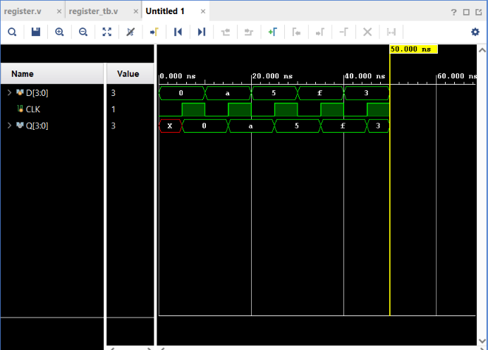

# 4-bit Register

## Objective

Design and simulate a **4-bit Register** using Verilog HDL and verify its functionality using a Verilog testbench.

A register is a group of storage elements used to store multiple bits of data. This project demonstrates how a 4-bit register captures and stores data on the **rising edge of a clock**.

## Inputs

* `D[3:0]` — 4-bit Data Input
* `CLK` — Clock

## Output

* `Q[3:0]` — 4-bit Stored Output

## Operation

The register captures the value of `D` whenever a rising edge occurs on `CLK`.

```text
CLK ↑
 ↓
Q <= D
```

For example:

```text
D = 1010
CLK ↑
Q = 1010
```

If `D` changes while there is no rising clock edge, `Q` retains its previous value.

## Truth Table

| Clock Event     | D         | Q(next)     |
| --------------- | --------- | ----------- |
| No rising edge  | Any value | Q(previous) |
| Rising edge `↑` | `0000`    | `0000`      |
| Rising edge `↑` | `1010`    | `1010`      |
| Rising edge `↑` | `0101`    | `0101`      |
| Rising edge `↑` | `1111`    | `1111`      |

## Verilog Implementation

The register was implemented using a clock-sensitive `always` block and a non-blocking assignment:

```verilog
always @(posedge CLK)
begin
    Q <= D;
end
```

The use of `<=` is appropriate for clocked sequential logic because the register updates its stored value at the clock event.

## 4-bit Vector

Instead of declaring four separate inputs:

```text
D3
D2
D1
D0
```

a 4-bit vector is used:

```verilog
input [3:0] D
```

This represents:

```text
D[3] D[2] D[1] D[0]
```

For example:

```verilog
D = 4'b1010;
```

represents:

```text
D[3] = 1
D[2] = 0
D[1] = 1
D[0] = 0
```

Similarly, `Q[3:0]` stores four bits.

## Testbench

A continuous clock was generated using:

```verilog
always #5 CLK = ~CLK;
```

This produces a **10 ns clock period** with rising edges every 10 ns.

The testbench applied different 4-bit data patterns:

```text
0000
1010
0101
1111
0011
```

These patterns were selected to verify different combinations of the four bits.

### Simulation Behavior

The waveform displayed the values in hexadecimal:

| Binary | Hexadecimal |
| ------ | ----------- |
| `0000` | `0`         |
| `1010` | `A`         |
| `0101` | `5`         |
| `1111` | `F`         |
| `0011` | `3`         |

The output `Q` captured each new value of `D` at the next rising clock edge.

## Simulation

**Tool:** Xilinx Vivado 2023.1

**Simulation Type:** Behavioral Simulation

**Simulation Time:** 50 ns

### Simulation Waveform



## Result

The simulation successfully verifies the operation of the 4-bit register.

The waveform demonstrates:

```text
D = 0000 → Q = 0000
D = 1010 → Q = 1010
D = 0101 → Q = 0101
D = 1111 → Q = 1111
D = 0011 → Q = 0011
```

The output changes only at the **rising edge of the clock**.

Thus, the **4-bit Register functionality was successfully verified through behavioral simulation in Vivado**.

## D Flip-Flop vs 4-bit Register

| D Flip-Flop         | 4-bit Register            |
| ------------------- | ------------------------- |
| Stores 1 bit        | Stores 4 bits             |
| `D` is 1 bit        | `D[3:0]` is 4 bits        |
| `Q` is 1 bit        | `Q[3:0]` is 4 bits        |
| One storage element | Group of storage elements |

## Files

| File            | Description                              |
| --------------- | ---------------------------------------- |
| `register.v`    | Verilog RTL design of the 4-bit Register |
| `register_tb.v` | Verilog testbench                        |
| `waveform.png`  | Vivado simulation waveform               |
| `README.md`     | Project documentation                    |

## Tools Used

* Verilog HDL
* Xilinx Vivado 2023.1

## Learning Outcome

This project helped me understand how multiple bits can be stored together using a **register**. I learned how Verilog vectors such as `[3:0]` represent multi-bit buses, how a register captures data on a rising clock edge, and why **non-blocking assignment (`<=`)** is used for clocked sequential logic. I also learned how to interpret multi-bit waveform values displayed in hexadecimal.

