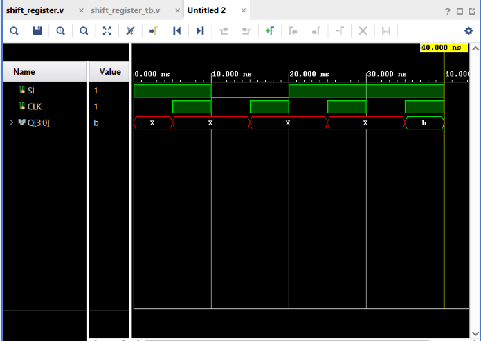

# 4-bit Shift Register

## Objective

Design and simulate a **4-bit Serial-In Shift Register** using Verilog HDL and verify its functionality using a Verilog testbench.

A shift register is a sequential logic circuit that stores data and shifts the stored bits by one position on every rising edge of the clock.

## Inputs

* `SI` — Serial Input
* `CLK` — Clock

## Output

* `Q[3:0]` — 4-bit Shift Register Output

## Operation

The shift register shifts data in through `Q[0]` and moves the existing bits toward `Q[3]`.

```text
SI → Q[0] → Q[1] → Q[2] → Q[3]
```

At every rising edge of the clock:

```verilog
Q[3] <= Q[2];
Q[2] <= Q[1];
Q[1] <= Q[0];
Q[0] <= SI;
```

## Example

Starting with an unknown register state, if the serial input sequence is:

```text
1 → 0 → 1 → 1
```

the register changes as follows:

| Clock Edge | SI | Q[3:0] |
| ---------: | -: | ------ |
|          1 |  1 | `XXX1` |
|          2 |  0 | `XX10` |
|          3 |  1 | `X101` |
|          4 |  1 | `1011` |

After four clock cycles:

```text
Q = 1011
```

The `X` values at the beginning represent unknown bits because the register has not been initialized or reset.

## Verilog Implementation

```verilog
module shift_register(
    input SI,
    input CLK,
    output reg [3:0] Q
);

    always @(posedge CLK)
    begin
        Q[3] <= Q[2];
        Q[2] <= Q[1];
        Q[1] <= Q[0];
        Q[0] <= SI;
    end

endmodule
```

### Why Non-Blocking Assignment?

Non-blocking assignment (`<=`) is used because all four bits must update **simultaneously** using their previous values.

For example:

```text
Before:
Q = 1010
SI = 1

After rising edge:
Q = 0101
```

All four assignments use the values that existed before the clock edge.

## Testbench

A 10 ns clock was generated using:

```verilog
initial begin
    CLK = 0;
    forever #5 CLK = ~CLK;
end
```

The serial input sequence used for testing was:

```text
1 → 0 → 1 → 1
```

This verifies that serial data enters the register and shifts through the four storage positions.

## Simulation

**Tool:** Xilinx Vivado 2023.1

**Simulation Type:** Behavioral Simulation

**Simulation Time:** 40 ns

### Simulation Waveform



## Result

The simulation successfully verifies the operation of the 4-bit shift register.

The serial input sequence:

```text
1 → 0 → 1 → 1
```

produces:

```text
XXX1 → XX10 → X101 → 1011
```

The final register value is:

```text
Q = 1011
```

The waveform confirms that data is shifted by one position on every **rising edge of the clock**.

Thus, the **4-bit Serial-In Shift Register functionality was successfully verified through behavioral simulation in Vivado**.

## 4-bit Register vs Shift Register

| 4-bit Register                | 4-bit Shift Register                         |
| ----------------------------- | -------------------------------------------- |
| Loads 4 bits simultaneously   | Loads 1 bit at a time                        |
| `Q <= D`                      | Bits shift between positions                 |
| Parallel data input           | Serial data input                            |
| Stores a complete 4-bit value | Serially moves data through storage elements |

## Files

| File                  | Description                                    |
| --------------------- | ---------------------------------------------- |
| `shift_register.v`    | Verilog RTL design of the 4-bit Shift Register |
| `shift_register_tb.v` | Verilog testbench                              |
| `waveform.png`        | Vivado simulation waveform                     |
| `README.md`           | Project documentation                          |

## Tools Used

* Verilog HDL
* Xilinx Vivado 2023.1

## Learning Outcome

This project helped me understand how **shift registers** work and how data can be moved between multiple flip-flops on every clock edge. I learned how Verilog vectors represent multiple bits, how non-blocking assignments allow simultaneous sequential updates, and how serial data can be shifted into a register one bit at a time.

