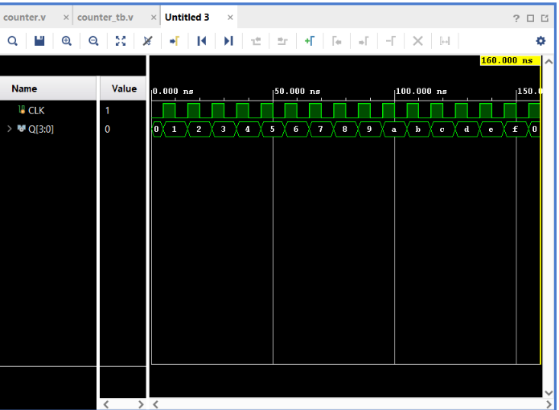

# 4-bit Binary Counter

## Objective

Design and simulate a **4-bit synchronous binary up-counter** using Verilog HDL and verify its functionality using a Verilog testbench.

The counter increments its stored value by 1 on every **rising edge of the clock**.

## Input

* `CLK` — Clock

## Output

* `Q[3:0]` — 4-bit Counter Output

## Operation

At every rising edge of `CLK`:

```verilog
Q <= Q + 1;
```

Therefore, the counter follows the sequence:

```text
0000 → 0001 → 0010 → 0011 → ...
```

or in decimal:

```text
0 → 1 → 2 → 3 → ... → 15 → 0
```

## Why It Is a Mod-16 Counter

The counter has 4 bits:

```verilog
reg [3:0] Q;
```

Therefore, it can represent:

$$
2^4 = 16
$$

different states:

```text
0000 → 1111
 0       15
```

After reaching `1111`, the next increment produces `10000`. Since `Q` can store only 4 bits, the fifth bit is discarded:

```text
1111 + 1 = 10000
                  ↓
                0000
```

Thus, the counter automatically wraps around from `15` back to `0`.

## Verilog Implementation

```verilog
module counter(
    input CLK,
    output reg [3:0] Q
);

    initial begin
        Q = 0;
    end

    always @(posedge CLK)
    begin
        Q <= Q + 1;
    end

endmodule
```

### Important Concepts

The counter uses:

```verilog
always @(posedge CLK)
```

to update only on the **rising edge** of the clock.

The non-blocking assignment:

```verilog
Q <= Q + 1;
```

is used for sequential logic.

The initial block:

```verilog
initial begin
    Q = 0;
end
```

starts the simulation with a known counter value of `0`.

## Testbench

A 10 ns clock was generated using:

```verilog
initial begin
    CLK = 0;
    forever #5 CLK = ~CLK;
end
```

The simulation was allowed to run for:

```verilog
#160;
```

Since the clock period is 10 ns:

$$
160/10 = 16
$$

clock cycles were observed, allowing the complete 4-bit counting sequence to be verified.

## Expected Count Sequence

The counter should produce:

```text
0 → 1 → 2 → 3 → 4 → 5 → 6 → 7
→ 8 → 9 → A → B → C → D → E → F → 0
```

Vivado displays the 4-bit output in hexadecimal.

| Hex | Binary | Decimal |
| --- | ------ | ------: |
| `0` | `0000` |       0 |
| `1` | `0001` |       1 |
| `2` | `0010` |       2 |
| `3` | `0011` |       3 |
| `4` | `0100` |       4 |
| `5` | `0101` |       5 |
| `6` | `0110` |       6 |
| `7` | `0111` |       7 |
| `8` | `1000` |       8 |
| `9` | `1001` |       9 |
| `A` | `1010` |      10 |
| `B` | `1011` |      11 |
| `C` | `1100` |      12 |
| `D` | `1101` |      13 |
| `E` | `1110` |      14 |
| `F` | `1111` |      15 |

## Simulation

**Tool:** Xilinx Vivado 2023.1

**Simulation Type:** Behavioral Simulation

**Simulation Time:** 160 ns

### Simulation Waveform



## Result

The simulation successfully verifies the 4-bit binary up-counter.

The waveform demonstrates that `Q` increments by one at every rising edge of `CLK`:

```text
0 → 1 → 2 → 3 → ... → E → F → 0
```

The transition:

```text
F → 0
```

confirms the modulo-16 wraparound behavior.

Thus, the **4-bit Binary Counter functionality was successfully verified through behavioral simulation in Vivado**.

## Register vs Counter

| 4-bit Register                  | 4-bit Counter                       |
| ------------------------------- | ----------------------------------- |
| Receives external data          | Generates its next value internally |
| `Q <= D`                        | `Q <= Q + 1`                        |
| Stores input data               | Automatically increments            |
| Changes when new data is loaded | Changes on every clock edge         |

## Files

| File           | Description                             |
| -------------- | --------------------------------------- |
| `counter.v`    | Verilog RTL design of the 4-bit Counter |
| `counter_tb.v` | Verilog testbench                       |
| `waveform.png` | Vivado simulation waveform              |
| `README.md`    | Project documentation                   |

## Tools Used

* Verilog HDL
* Xilinx Vivado 2023.1

## Learning Outcome

This project helped me understand how a **clock-driven binary counter** works. I learned how sequential logic can generate its own next state, how a 4-bit vector represents 16 possible states, why `Q <= Q + 1` is used in a clocked block, and how a counter wraps from `1111` back to `0000`. I also learned to interpret hexadecimal values in a multi-bit simulation waveform.

