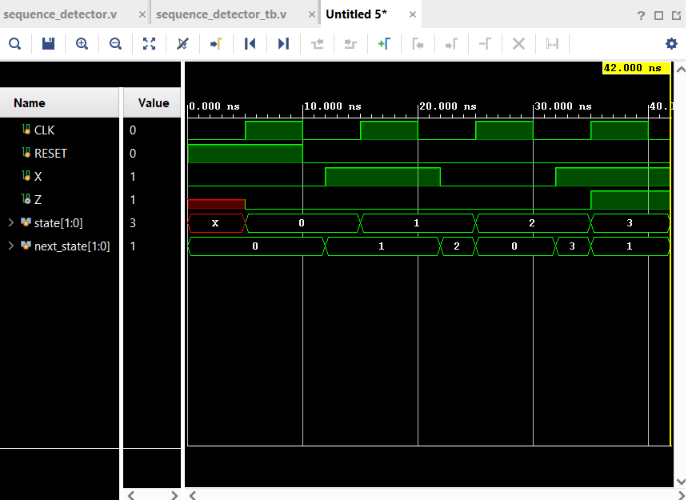

# 24 - 101 Sequence Detector FSM

## Objective

Design and simulate a Finite State Machine (FSM) that detects the binary sequence `101` from a serial input stream.

When the sequence `101` is detected, the output `Z` becomes `1`.

This project implements a Moore FSM.

## FSM States

| State | Binary | Description |
|-------|--------|-------------|
| S0 | `00` | No sequence detected |
| S1 | `01` | Received `1` |
| S2 | `10` | Received `10` |
| S3 | `11` | Detected `101` |

## State Transition Table

| Current State | X = 0 | X = 1 |
|---------------|--------|--------|
| S0 | S0 | S1 |
| S1 | S2 | S1 |
| S2 | S0 | S3 |
| S3 | S2 | S1 |

## Input and Output

| Signal | Direction | Description |
|--------|-----------|-------------|
| `CLK` | Input | Clock signal |
| `RESET` | Input | Resets the FSM to S0 |
| `X` | Input | Serial binary input |
| `Z` | Output | Goes HIGH when `101` is detected |

## FSM Operation

For the input sequence:

```text
1 → 0 → 1
````

The FSM transitions as:

```text
S0 → S1 → S2 → S3
```

When the FSM reaches `S3`:

```text
Z = 1
```

## Verilog Implementation

The FSM consists of three main blocks:

1. State Register
2. Next-State Logic
3. Output Logic

### State Register

```verilog
always @(posedge CLK)
begin
    if(RESET)
        state <= S0;
    else
        state <= next_state;
end
```

### Next-State Logic

```verilog
always @(*)
begin
    case(state)

        S0:
            if(X)
                next_state = S1;
            else
                next_state = S0;

        S1:
            if(X)
                next_state = S1;
            else
                next_state = S2;

        S2:
            if(X)
                next_state = S3;
            else
                next_state = S0;

        S3:
            if(X)
                next_state = S1;
            else
                next_state = S2;

        default:
            next_state = S0;

    endcase
end
```

### Output Logic

```verilog
always @(*)
begin
    if(state == S3)
        Z = 1;
    else
        Z = 0;
end
```

## Testbench

The testbench generates the clock, applies reset, and provides the input sequence `101`.

Clock generation:

```verilog
initial begin
    CLK = 0;
    forever #5 CLK = ~CLK;
end
```

The input sequence applied during simulation is:

```text
101
```

The expected output is:

```text
Z = 1
```

when the FSM reaches state `S3`.

## Simulation

The design was simulated using:

* Verilog HDL
* Xilinx Vivado 2023.1
* Vivado Behavioral Simulation

### Expected State Sequence

```text
S0 → S1 → S2 → S3
```

The waveform confirms that the FSM correctly detects the sequence `101`.

## Waveform



## Files

```text
24_Sequence_Detector/
├── sequence_detector.v
├── sequence_detector_tb.v
├── waveform.png
└── README.md
```

## Tools Used

* Verilog HDL
* Xilinx Vivado 2023.1
* Vivado Behavioral Simulation

## Learning Outcomes

* Finite State Machine (FSM) design
* Moore FSM architecture
* State encoding
* State registers
* Next-state combinational logic
* Output logic
* `case` statements
* Clocked `always` blocks
* Combinational `always` blocks
* Sequence detection using RTL
* FSM waveform analysis

## Result

The `101 Sequence Detector FSM` was successfully designed and simulated using Verilog.

The FSM correctly detects the binary sequence `101` and generates `Z = 1` when the sequence is detected.

```
```

FSM simulation and waveform analysis
Sequence detection using RTL
